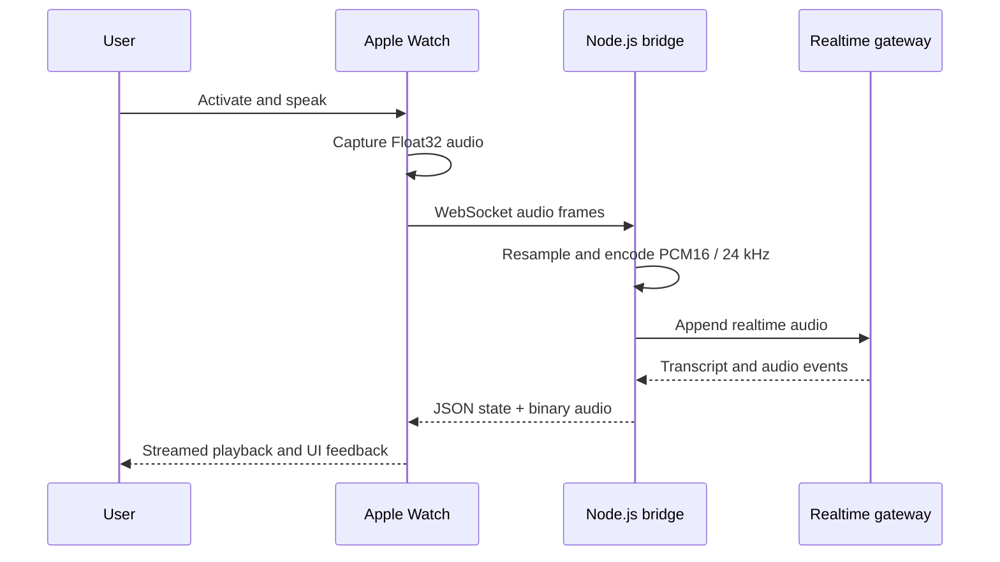

# LEDA for watchOS

A watch-first realtime voice assistant prototype built with SwiftUI, AVFoundation, WebSockets, and a Node.js audio bridge.

LEDA explores a specific product question: what changes when the watch is the primary interface for an assistant, rather than a miniature companion screen? The interaction combines an Omnitrix-inspired dial, microphone capture, streamed speech, audio playback, and explicit conversation state on the wrist.

## System design



The watch and bridge use a deliberately small protocol: JSON control messages communicate readiness, transcripts, completion, and errors; binary WebSocket frames carry audio. `RealtimeLedaController` owns the turn lifecycle so recording pauses during playback and resumes only after the final audio chunk.

## Engineering highlights

- Direct microphone capture with `AVAudioEngine` and watchOS audio-session handling
- Realtime WebSocket transport with distinct control and binary audio messages
- Float32-to-PCM16 conversion plus linear resampling to a 24 kHz gateway contract
- Streamed playback buffering on the watch
- Explicit activation, connecting, listening, thinking, speaking, and error states
- Compatibility fallback when gateway versions reject optional session fields
- Turn-level latency instrumentation for transcript and first-audio milestones

## Repository map

```text
LedaWatchOS/
├── LedaWatchOS Watch App/
│   ├── ContentView.swift              interface and interaction states
│   ├── RealtimeLedaController.swift   conversation lifecycle
│   ├── AudioManager.swift             microphone capture
│   ├── LedaSocketClient.swift         Watch-to-bridge transport
│   └── RealtimeAudioPlayer.swift      streamed playback
└── LedaWatchOS.xcodeproj/

Leda_Bridge/
├── realtime-server.mjs                realtime audio gateway
├── server.js                          earlier batch prototype
├── package.json
└── package-lock.json
```

## Run the prototype

### 1. Configure the bridge

Use environment variables; do not place gateway credentials in source control.

```bash
cd Leda_Bridge
npm ci
export OPENCLAW_GATEWAY_URL=ws://127.0.0.1:18789
export OPENCLAW_GATEWAY_TOKEN=your_local_token
npm run realtime
```

The bridge listens on port `8766` by default. Override it with `LEDA_REALTIME_BRIDGE_PORT`.

### 2. Configure the watch target

Open `LedaWatchOS/LedaWatchOS.xcodeproj` in Xcode. The Watch app must connect to a bridge hostname reachable from the selected Simulator or device. For a physical Watch, use a local-network hostname or address and ensure both devices can reach it.

### 3. Build and run

Select the Watch app target, choose a Watch Simulator, and run from Xcode. Start the bridge before activating a realtime session.

## Design decisions

- **Binary audio frames:** avoids base64 expansion on the watch-to-bridge hot path.
- **Bridge-side resampling:** keeps gateway-specific audio contracts out of the watch UI layer.
- **Recording/playback coordination:** prevents the assistant's output from being captured as new user input.
- **Protocol errors surfaced to UI:** unavailable services produce a visible error state instead of fake playback.
- **Gateway credentials stay on the Mac:** the Watch client never receives backend credentials.

## Verification and boundaries

The Swift target and bridge syntax have been exercised during development, and the repository implements the full Watch-to-bridge code path. Simulator/build success is not the same as a production-ready wearable assistant: physical-device latency, microphone and speaker behavior, network transitions, accessibility, long-session reliability, and deployment security still require dedicated validation.

This is an active prototype. It is intentionally presented as engineering exploration, not a shipped App Store product.
